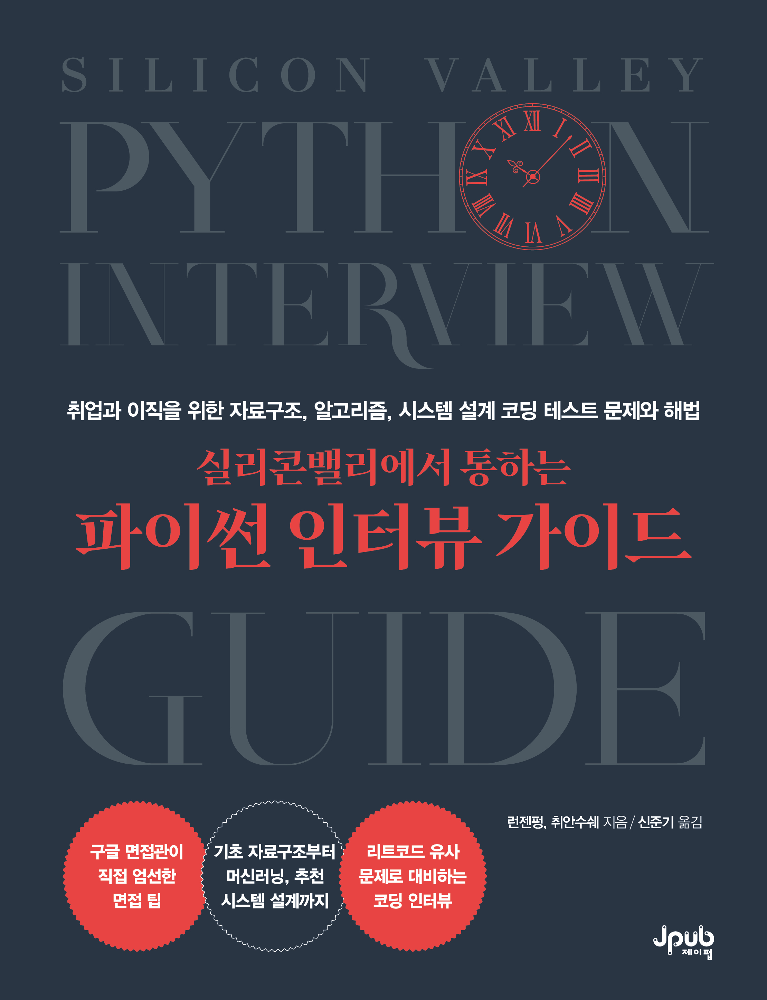

# 실리콘밸리에서 통하는 파이썬 인터뷰 가이드

이 저장소는 실리콘밸리에서 자주 등장하는 파이썬 인터뷰 문제들을 다룬 예제 코드들을 포함하고 있습니다. 모든 코드는 실습 예제 형식으로 제공되며, 해당 문제를 푸는 데 필요한 핵심 알고리즘 및 기술을 설명합니다.

## 책 표지

## 환경 설정

이 코드 예제들을 실행하기 위해 별도의 복잡한 설치 없이도 온라인에서 실행할 수 있는 방법을 제공하고 있습니다.

### 1. 온라인에서 실행하기
코드를 로컬 환경에 설치하지 않고도 쉽게 실행할 수 있습니다. 아래의 옵션을 이용해 실행할 수 있습니다:

- **Google Colab**을 이용한 실행:
  [**Open In Colab**](https://colab.research.google.com/drive/1pKFtIIEq5JSSML3m_NukyAMWvYYHW4vu?usp=sharing)  
  Google Colab은 웹 기반으로 Python 코드를 실행할 수 있는 환경을 제공합니다. 인터넷만 있으면 어떤 컴퓨터에서든 실행할 수 있습니다.  

### 2. 로컬에서 실행하려면
로컬 환경에서 실행할 경우, **Python**이 설치되어 있어야 합니다. 대부분의 코드 예제는 기본적으로 Python 표준 라이브러리만 사용하고 있기 때문에 추가 라이브러리를 설치할 필요는 없습니다.
